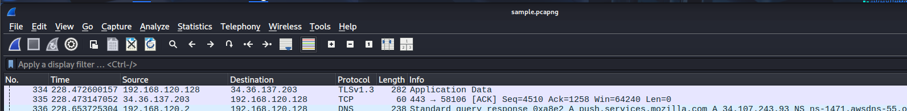
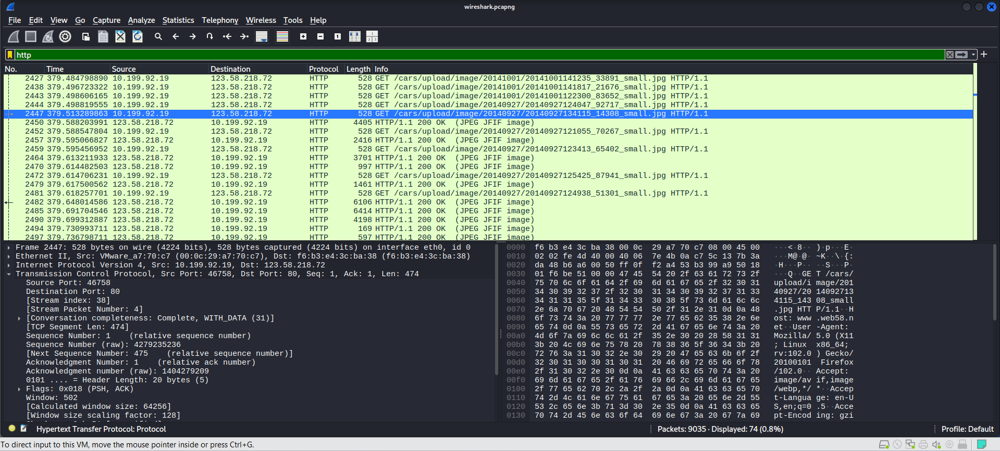
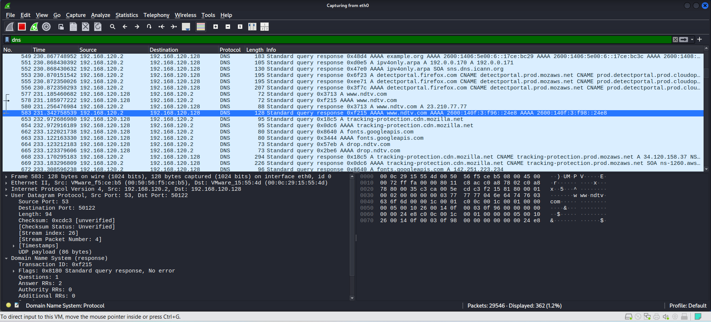
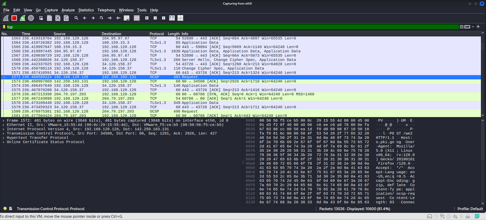

# Wireshark-Network-Traffic-Analysis

## 🌐 What is a Network?
A **network** is a group of two or more computers or devices connected together so they can share:
- Information (files, messages)
- Resources (printers, storage)
- Internet access  

**Example:** Your home Wi-Fi connects your phone, laptop, and smart TV.  

## 📦 What is a Packet?
A **packet** is the smallest unit of data sent over a network.  
- Data is broken into small packets before sending.  
- Each packet contains:
  - **Header** → information like sender, receiver, and type of data.  
  - **Payload** → the actual data.  

**Example:** Sending a photo splits it into many packets. Those packets travel across the network and are reassembled at the receiver’s end.  

## 🚦 What is Network Traffic?
**Network traffic** is the flow of data moving across a network.  
Think of it like vehicles moving on a road — here, **data** is the vehicle.  

**Examples:**
- Watching YouTube → video data flows in.  
- Sending a WhatsApp message → message data flows out.  

---

## 🖥️ What is Wireshark?
**Wireshark** is a free tool used to see what is happening on your network.  
It captures small pieces of data called **packets** and shows them to you.  
Packets are like letters that computers send to each other.
It helps you see what data is flowing in and out of your network in real time.

#### Example:
- When you open a website, your computer sends a packet (request).
- The website replies back with another packet (response).

**Use Cases:**
- Troubleshoot network issues  
- Learn how network protocols work  
- Monitor network activity 

## 🛠 How to Install Wireshark
1. Go to [Wireshark Official Website](https://www.wireshark.org/download.html).
2. Download the installer for your operating system (Windows, Linux, or Mac).
3. Install it with default settings.

## 🔍 Capturing Packets in Wireshark
1. Open Wireshark.  
2. Select your network interface (like Wi-Fi or Ethernet).  
3. Click the **blue shark fin button** (▶️) to start capture.
4. Browse a website or run a `ping google.com` command to generate traffic.
5. You will see packets listed on the screen.
6. Click the **red square button** 🟥 to stop capture when you have enough data. 

## 🔍 How to Read Packets
Each packet has:
- **No.** – The packet number
- **Time** – When it was captured
- **Source** – Who sent it
- **Destination** – Who received it
- **Protocol** – The language of communication (HTTP, DNS, TCP, etc.)
- **Info** – Short description of what the packet is

---
## 🎯 Using Filters
Filters help you find specific packets. Type them in the **filter bar** at the top:

- `http` → Show only web traffic  
- `dns` → Show only DNS lookups  
- `tcp` → Show only TCP packets  
- `icmp` → Show ping requests/replies  

✅ If the filter is correct → the bar turns **green**  
❌ If the filter is wrong → it turns **red**

### Example:
- Before filtering → You see all packets mixed.

  
- After applying `http` → Only web traffic remains.  

    

- After applying `dns` → Only DNS lookups appear.  

  
   
- After applying `tcp` → Only TCP lookups appear.  

   

- After applying `icmp` → Only ICMP lookups appear.  

   

---

## 📜 Description of `wireshark.pcapng`
This file contains sample network traffic including:
- **HTTP packets** (web browsing requests)
- **DNS queries** (domain lookups like `example.com`)
- **TCP connections** (communication between computers)
  
You can open this [file](wireshark.pcapng) on wireshark and practice applying different filters.

